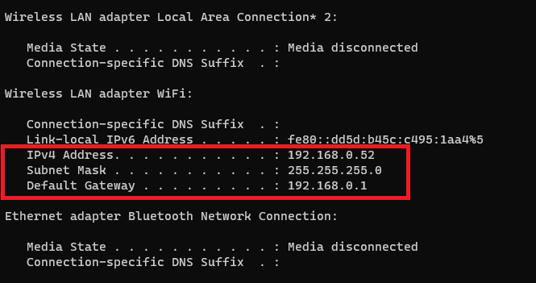

# Initial Setup

Instructions are for windows laptop specifically, but should be similar for all OS.

## Setup SD Card

- [Download Raspberry Pi Imager and install Raspberry Pi OS on SD Card](https://www.raspberrypi.org/downloads/)
  - Raspberry Pi OS (32 bit) 
- You'll probably need to remove SD Card and re-plug into laptop for next steps
- Enable headless access
  - [Enable wifi](https://www.raspberrypi.org/documentation/configuration/wireless/headless.md)
  - [Enable ssh](https://www.raspberrypi.org/documentation/remote-access/ssh/README.md)
    - Add empty file named `ssh` to root directory
- Eject SD card from laptop and insert into Pi
- Power on Raspberry Pi and give it a few minutes to startup
  - Should not need to be connected to monitor/TV

## Find Raspberry Pi's IP Address

On laptop:

- Install ssh client
  - [Putty](https://www.putty.org/)
- Install [nmap](https://nmap.org/download.html)
- Open command line
- Run `ipconfig` to find laptop's IP Address and Subnet Mask

- Using the info from the above run `nmap` in command line to find all devices connected to local network
  - `nmap -sn 192.168.0.0/24`
  - Look for entry that says `Raspberry Pi` (you may need to run multiple times)

## Connect to Raspberry Pi from laptop

* Open Putty on laptop
  * `Host Name (or IP address)=192.168.0.54` (from nmap command above)
  * `Port=22` 
  * This will connect to command line on Raspberry Pi
* [Enable VNC](https://www.raspberrypi.org/documentation/remote-access/vnc/README.md)

## Thanks to

- https://medium.com/coinmonks/run-raspberry-pi-in-a-true-headless-state-cfb3431667de

[Back to index](index.md)
