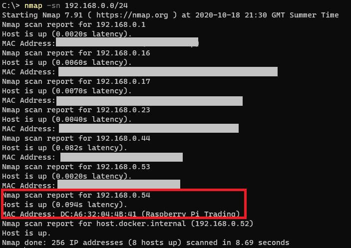

# Setup Raspberry Pi with headless access

You don't need a monitor, screen or tv to be able to use your Raspberry Pi. You can easily setup headless access using your laptop to directly access the Pi.

## Setup SD Card

* [Download Raspberry Pi Imager and install Raspberry Pi OS on SD Card](https://www.raspberrypi.org/downloads/)
  * Raspberry Pi OS (32 bit) 
* You'll probably need to remove SD Card and re-plug into laptop for next steps
* Enable headless access
  * [Enable wifi](https://www.raspberrypi.org/documentation/configuration/wireless/headless.md)
  * [Enable ssh](https://www.raspberrypi.org/documentation/remote-access/ssh/README.md)
    * Add empty file named `ssh` to root directory
* Eject SD card from laptop and insert into Pi
* Power on Raspberry Pi and give it a few minutes to startup
  * Should not need to be connected to monitor/TV, but it can be useful to see whats going on

## Find Raspberry Pi's IP Address

On laptop:

* Install ssh client (eg [Putty](https://www.putty.org/))
* Install [nmap](https://nmap.org/download.html)
* Open command line
* Run `ipconfig` to find laptop's IP Address and Subnet Mask


* Using the info from the above run `nmap` in command line to find all devices connected to local network
  * `nmap -sn 192.168.0.0/24`
  * Look for entry that says `Raspberry Pi` (you may need to run multiple times)



## Connect to Raspberry Pi from laptop

### Command line

* Open Putty on laptop
  * `Host Name (or IP address)=192.168.0.54` (use IP from nmap command above)
  * `Port=22` 
  * `login as=pi`
  * `password=raspberry`
  * This will connect to command line on Raspberry Pi
* Change password
  * When you connect to the Pi command line, you will see a message like `SSH is enabled and the default password for the 'pi' user has not been changed. This is a security risk - please login as the 'pi' user and type 'passwd' to set a new password.`. 
  * Lets fix that and create a more secure user login

```
pi@raspberrypi:~ $ sudo passwd pi
New password: 
Retype new password: 
passwd: password updated successfully
```

Update Raspberry Pi via command line

```
sudo apt update
sudo rpi-update
sudo reboot
```

### Desktop view

[Enable VNC (Virtual Network Computing)](https://www.raspberrypi.org/documentation/remote-access/vnc/README.md)

#### On Raspberry Pi command line

Reconnect to Pi via SSH

```
sudo apt install realvnc-vnc-server realvnc-vnc-viewer
sudo raspi-config
```

* Enable VNC Server by doing the following:
  * Navigate to `Interfacing Options`
  * Scroll down and select `VNC` > `Yes`
  * Exit setup
* Find Raspberry Pi IP, run `ifconfig`
  * If you haven't restarted Pi, the IP should be the same as `Find Raspberry Pi's IP Address` step

#### On laptop

* Install [VNC Viewer](https://www.realvnc.com/en/connect/download/viewer/)
* Start VNC Viewer
  * Enter Pi's IP address into bar
  * Username and password is either `pi` and `raspberry` or whatever you changed it to earlier
* You should now be able to see and control the Raspberry Pi desktop from your laptop 

## Thanks to

* https://medium.com/coinmonks/run-raspberry-pi-in-a-true-headless-state-cfb3431667de

[Back to index](index.md)
