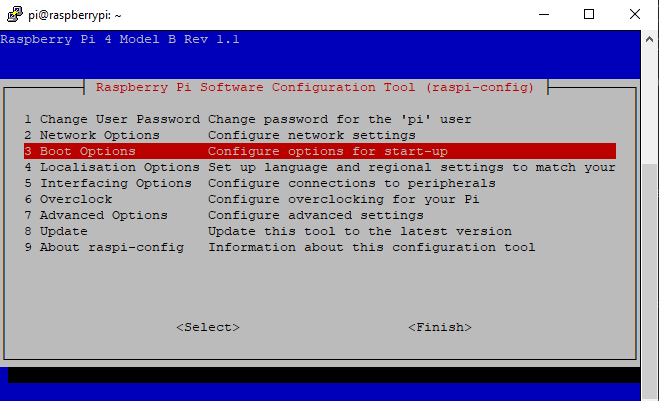
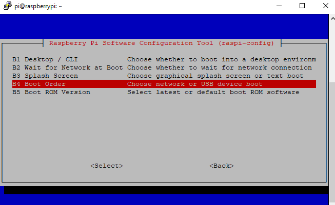

# Boot from USB drive

SD cards were never intended for fast read-write access. Attaching a SSD drive via USB 3.0 port can [provide a dramatic increase to performance](https://www.tomshardware.com/uk/news/raspberry-pi-4-ssd-test,39811.html).

The Raspberry Pi 4 B comes with two USB 3.0 ports, and you can pick up a portable SSD to USB 3.0 enclusure easily, eg

* https://www.amazon.co.uk/gp/product/B07D2BHVBD
* https://www.amazon.co.uk/gp/product/B07RZBTNTN

Also get a compatible HDD/SSD drive to fit the enclosure, add to the enclosure.

Connect drive to USB 3.0 port on the Raspberry Pi.

## Enable USB mass storage boot

* Connet to Pi command line via SSH (details in [Setup Raspberry Pi with headless access](01_setup_headless_raspberry_pi.md))
* Run `sudo raspi-config`
* Choose `Boot Options`

* Choose `Boot order`

* Choose `USB Boot`
* Then reboot Raspberry Pi

## More details

* https://www.raspberrypi.org/documentation/hardware/raspberrypi/bootmodes/msd.md
* https://www.raspberrypi.org/documentation/configuration/raspi-config.md

[Back to index](index.md)
