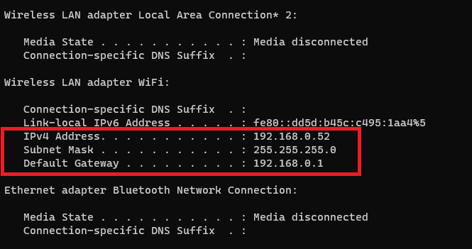
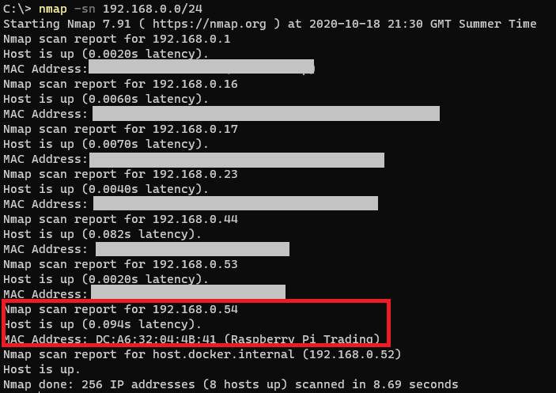

# Connect to Raspberry Pi from laptop

## Find Raspberry Pi's IP Address

On laptop:

* Install ssh client (eg [Putty](https://www.putty.org/) or [Windows Terminal SSH](https://docs.microsoft.com/en-us/windows/terminal/tutorials/ssh))
* Install [nmap](https://nmap.org/download.html)
* Open command line (PowerShell)
* Run `ipconfig` to find laptop's IP Address and Subnet Mask



* Using the info from the above run `nmap` in command line to find all devices connected to local network
  * `nmap -sn 192.168.0.0/24`
  * Look for entry that says `Raspberry Pi` (you may need to run multiple times)




## Connect to Pi command line

* Open SSH client on laptop (eg Putty)
  * `Host Name (or IP address)=192.168.0.54` (use IP from nmap command above)
  * `Port=22` 
  * `login as=pi`
  * This will connect to command line on Raspberry Pi

OR

* Open powershell command line
  * `ssh pi@192.168.0.54`

Then login
* `password=raspberry` (default password, but should be changed during initial setup)


## Connect to Pi Desktop view from laptop

**NOTES:**
* For non-Lite OS install only
* [Enable VNC (Virtual Network Computing)](https://www.raspberrypi.org/documentation/remote-access/vnc/README.md)

### On Raspberry Pi command line

Connect to Pi via SSH and run

```
sudo apt install realvnc-vnc-server realvnc-vnc-viewer
sudo raspi-config
```

* Enable VNC Server by doing the following:
  * Navigate to `Interfacing Options`
  * Scroll down and select `VNC` > `Yes`
  * Navigate back to main menu
* Update screen resolution so can use VPC Viewer
  * Navigate to `Display Options` > `Resolution`
  * Select a resolution other than `Default`
* Exit setup
* Reboot Pi 

### On laptop

* Install [VNC Viewer](https://www.realvnc.com/en/connect/download/viewer/)
* Start VNC Viewer
  * Enter Pi's IP address into bar
  * Username and password is either `pi` and `raspberry` or whatever you changed it to earlier
* You should now be able to see and control the Raspberry Pi desktop from your laptop

[Back to index](index.md)