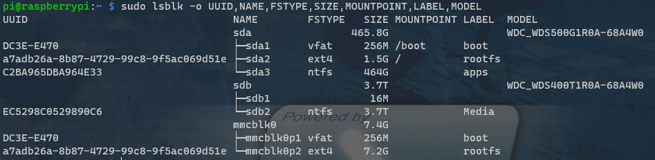
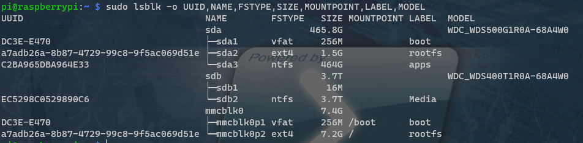

# Boot from USB drive

SD cards were never intended for fast read-write access. Attaching a SSD drive via USB 3.0 port can [provide a dramatic increase to performance](https://www.tomshardware.com/uk/news/raspberry-pi-4-ssd-test,39811.html). The Raspberry Pi 4 B comes with two USB 3.0 ports.

## Hardware

You need some form of USB storage
* SSD/HDD to USB 3.0 enclusure
  * PCB's built specifically for Pi to SSD/HDD use
    * make sure it has its own power supply for more reliable/longer lasting SSD/HDD 
    * https://www.amazon.co.uk/gp/product/B088GN6CPF
      * ^^ is what I ended up using with a 500Gb SSD for boot/OS drive, and a 4TB SSD for media drive
    * https://www.amazon.co.uk/gp/product/B07VXF2HJG
  * Raspberry Pi 4 case with built in SSD/HDD expansion
    * https://thepihut.com/products/argon-one-m-2-raspberry-pi-4-case
    * https://thepihut.com/products/retroflag-nespi-4-case-for-raspberry-pi-4
  * Powered USB hub
    * https://www.amazon.co.uk/gp/product/B07JGT17B8
    * https://www.amazon.co.uk/gp/product/B07CNZLFGZ
  * USB C to SSD cable/enclosure (not recommended, but possible)
    * The Pi USB ports will likely not have enough power to reliably run an unpowered USB SSD enclosure
	* There are some options that have been tested by Pi users. eg
	  * https://thepihut.com/collections/raspberry-pi-cables/products/ssd-to-usb-3-0-cable-for-raspberry-pi
 * A compatible SSD/HDD drive to fit your chosen enclosure
   * **IMPORTANT:** Raspberry Pi OS currently only works with drives formatted as (MBR), and these drives are limited to 2Tb
     * If you want a media drive larger than 2Tb, and to boot the Pi from SSD, then you will need to have dual SSD drives - one <=2TB for the OS, and one for the media
       * https://www.amazon.co.uk/gp/product/B088GN6CPF 
       * Ref: 
	     * https://www.raspberrypi.org/forums/viewtopic.php?t=241914
	     * https://docs.microsoft.com/en-us/windows-server/storage/disk-management/change-an-mbr-disk-into-a-gpt-disk
* Standard Portable USB drive (not recommended)
  * Its possible to setup with a USB flash drive, but apparently it does not perform well. Use this option only to test out the process

## Prepare USB drive

### Format USB drive (optional)

You may need to format the USB drive partitions before continuing. There are a few things that you should consider before doing so.
* Which OS do you wish to access the NAS from?
  * Windows: NTSF format will allow you to setup a shared network drive from your laptop, so can easily access files and drag/drop from laptop to NAS
* Other?

To merge and format Unallocated partitions
* Connact USB drive to laptop
* Open Windows 10 Disk Management and inspect the drive

* If your drive is larger than 2Tb and/or you can see multiple partiions:
  * Right click on any allocated partitions and `Delete volume`
  * Right click on the left `Disk 1 - Basic - Online` area and click `Convert to GTB disk`
  * You should now see only one `Unallocated` partition
* Right click on the `Unallocated` partition
  * `New simple volume` > `Next`
  * Ensure the `Simple volume size` is set to the maximum
  * Select `Assign the following drive letter`
  * Format with chosen file system (ie `ntfs`) and assign a label if you want
* Safely eject USB drive from laptop

More reading
* https://openmediavault.readthedocs.io/en/5.x/administration/storage/filesystems.html
* https://www.raspberrypi.org/documentation/configuration/external-storage.md
* https://www.windowscentral.com/how-delete-drive-partition-windows-10
* https://www.windowscentral.com/how-format-new-hard-drive-windows-10

### Install Raspberry Pi OS Lite on USB drive

**NOTE:** This will remove any existing data on the USB drive

* Connect USB drive to laptop
* Follow the steps from [Setup Raspberry Pi with headless access > Setup SD Card](01_setup_headless_raspberry_pi.md#setup-sd-card), except do for USB drive instead of SD Card
  * Use the `Raspberry Pi OS Lite` version, it has greater compatibility with OpenMediaVault that we're going to use for the NAS
  * Remember to do the "Enable headless access" steps too
* Safely eject USB drive from laptop

### Ensure the Pi recognises the USB drive

* Plug USB drive into Pi
* Run `sudo lsblk -o UUID,NAME,FSTYPE,SIZE,MOUNTPOINT,LABEL,MODEL`
* You should see something like this

* Its showing that we have two drives attached to the Pi
  * `sda`: This is my WD USB drive. Which has 3.7Tb drive
  * `mmcblk0`: This is the 8GB SD Card in the Pi

## Prepare Pi to Boot from USB drive

### Raspberry Pi 4 requires recent boot EEPROM

* Check [Raspberry Pi 4 boot EEPROM](https://www.raspberrypi.org/documentation/hardware/raspberrypi/booteeprom.md) version
  * From SSH command line run `rpi-eeprom-update` to check if you need to update it

* If you need to update the eeprom version run `sudo rpi-eeprom-update -d -a`

### Enable USB mass storage boot

* Run `sudo raspi-config`
* Choose `Advanced Options`

* Choose `Boot order`

* Choose `USB Boot`
* Exit the `raspi-config` screen
* Shutdown the Pi from command line: `sudo shutdown -h now`
* Remove SD Card from Pi

## Boot

* Ensure Raspbery Pi is still powered down from previous step
* Connect drive to USB 3.0 port on the Raspberry Pi
* Start the Pi
  * Depending on the size of the drive, this could take a while
  * You may need to repeat [Find Raspberry Pi's IP Address](https://github.com/saan800/pimedia/blob/main/docs/02_connect_to_raspberry_pi_from_laptop.md#find-raspberry-pis-ip-address) steps
* To confirm that Pi is loading from USB run `sudo lsblk -o UUID,NAME,FSTYPE,SIZE,MOUNTPOINT,LABEL,MODEL`

You'll see a response like this with `boot` on the USB drive:

* Run same updates from [Update Raspberry Pi via command line](01_setup_headless_raspberry_pi.md#update-raspberry-pi-via-command-line)

## More details

* https://www.raspberrypi.org/documentation/hardware/raspberrypi/bootmodes/msd.md
* https://www.raspberrypi.org/documentation/configuration/raspi-config.md
* https://www.raspberrypi.org/documentation/hardware/raspberrypi/bcm2711_bootloader_config.md
* https://www.raspberrypi.org/documentation/configuration/raspi-config.md

[Back to index](index.md)
