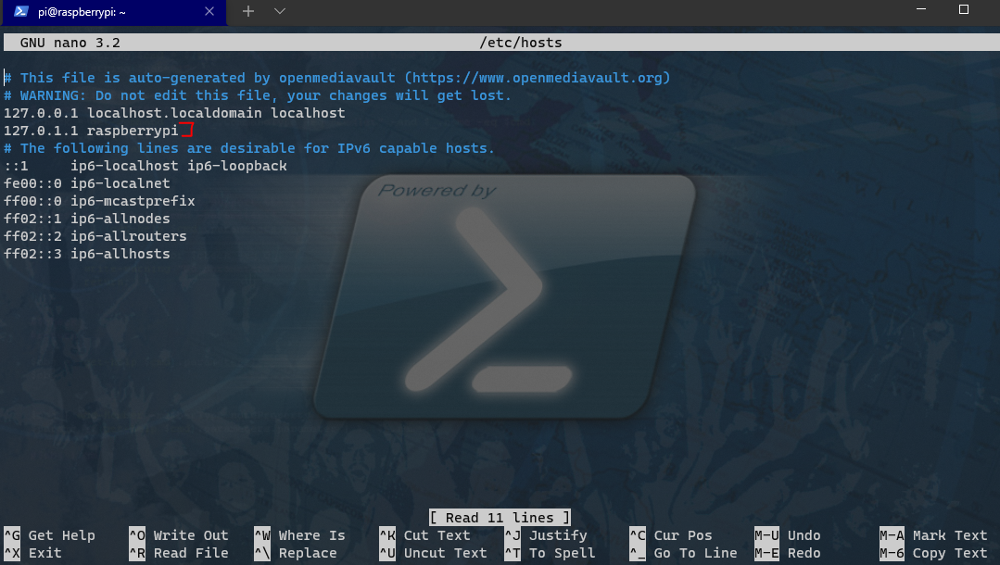
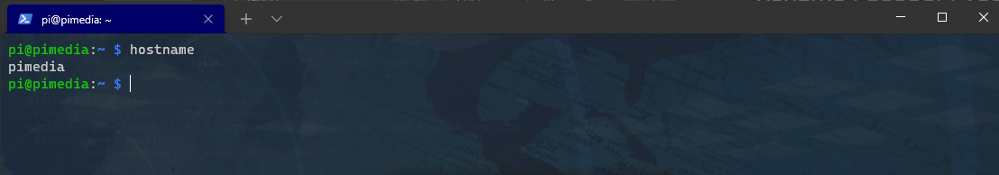

# Rename `raspberrypi` to `pimedia`

If you have multiple Pi's on the network renaming the pi to something more description will help in visibility.

* [Connect to the Pi command line over SSH](02_connect_to_raspberry_pi_from_laptop#connect-to-pi-command-line)
* `sudo nano /etc/hostname`
  * Change `raspberrypi` to `pimedia`
  * Save the file using `Ctrl+x`, then `Y` followed by Enter
* `sudo nano /etc/hosts`
  * Change `raspberrypi` to `pimedia`
  * Save the file using `Ctrl+x`, then `Y` followed by Enter

* Reboot pi: `sudo reboot`
* [Connect to the Pi command line over SSH](02_connect_to_raspberry_pi_from_laptop#connect-to-pi-command-line)
* The command line should now show the new pi's name

## More details 

* [Renaming your Raspberry Pi - the 'hostname'](https://thepihut.com/blogs/raspberry-pi-tutorials/19668676-renaming-your-raspberry-pi-the-hostname)