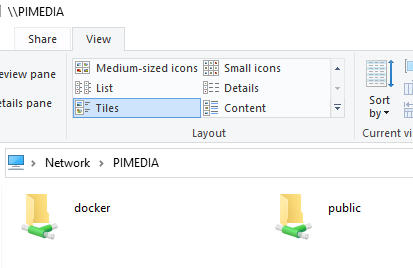

# Open Media Vault

## Install Open Media Vault

* Sign into Pi via SSH and run
* Run the following and wait for it to finish, then reboot

```bash
wget -O - https://raw.githubusercontent.com/OpenMediaVault-Plugin-Developers/installScript/master/install | sudo bash
```

## Setup Open Media Vault

* Open OMV in laptop web browser: `http://[RASPBERRY_PI_IP]/`
  * Or if you've [Renamed `raspberrypi` to `pimedia`](04_rename_pi.md) you should be able to open OMV via `http://pimedia/`
* Sign in:
  * Username: admin
  * Password: openmediavault
* Change default password
  * Go to `Settings` > `General Settings` then `Web Administrator Password`
  * Reset the password and save
* Setup network
  * Go to `System` > `Network` > then `Interfaces` tab
  * Ensure network details are listed
    * Ethernet
      * Device: `eth0`
      * IPv4 Method: `DHCP`
      * IPv6 Method: `DHCP`
  * Go to `Services` > `SSH`
    * Ensure enabled
  
## NAS

* Setup user
  * Go to `Access Rights Management` > `User`
  * Click `Add`
    * Enter details of new user
    * Select appropriate groups for user
      * Read media server only (eg Plex, Kodi, Nvidea shield, other users): `users` and `sambashare` (TODO: any others??)
      * Manage from laptop user:
        * `adm`
        * `root`
        * `sambashare`
        * `ssh`
        * `users`
        * `www-data`
* Ensure all drives are mounted
  * Go to `Storage` > `File Systems`
* Create shared folders
  * Go to `Access Rights Management` > `Shared Folders`
  * Add a `docker` folder to the drive that will contain apps
  * Add a `public` folder to the drive that will contain media files
  * On each of the shared folders
    * Click `Privileges` and add `Read/Write` to appropriate users (eg `docker` should only be allowed for admin users and `pi`)
    * `acl` ???
* Enabling SAMBA/CIFS
  * Go to `Services` > `SMB/CIFS`
  * `General Settings` > turn on `Enable`
  * `Save`
  * Open the `Shares` tab
    * Select the shared drive you just created
    * Set permissions

### Access shared drive from laptop

Windows

* Must be on same wifi/network that the Pi is connected to
* Open file explorer
* Go to `Network` on left menu
* Find `PIMEDIA` on page
  * Double click to open shared drives
  * Login using a user that you setup in previous step
  * You should be able to see the folders `docker` and `public`



## Docker using Portainer


## More details

* https://pimylifeup.com/raspberry-pi-openmediavault/
* [Install OpenMediaVault 5 on Raspberry Pi 4](https://www.youtube.com/watch?v=5YwQLJaeel0&list=PLulABMF2ltKoQFbhWSZpvhQx9KXXMibKa&index=22)
* [OpenMediaVault 5 NAS server installation on Raspberry Pi 4](https://www.youtube.com/watch?v=InKFsKp865c&list=PLulABMF2ltKoQFbhWSZpvhQx9KXXMibKa&index=23)
* [Docker installation on External storage OpenMediaVault 5 with Portainer using Raspberry Pi 4](https://www.youtube.com/watch?v=HinflCTwFcE&list=PLulABMF2ltKoQFbhWSZpvhQx9KXXMibKa&index=24)

[Back to index](index.md)