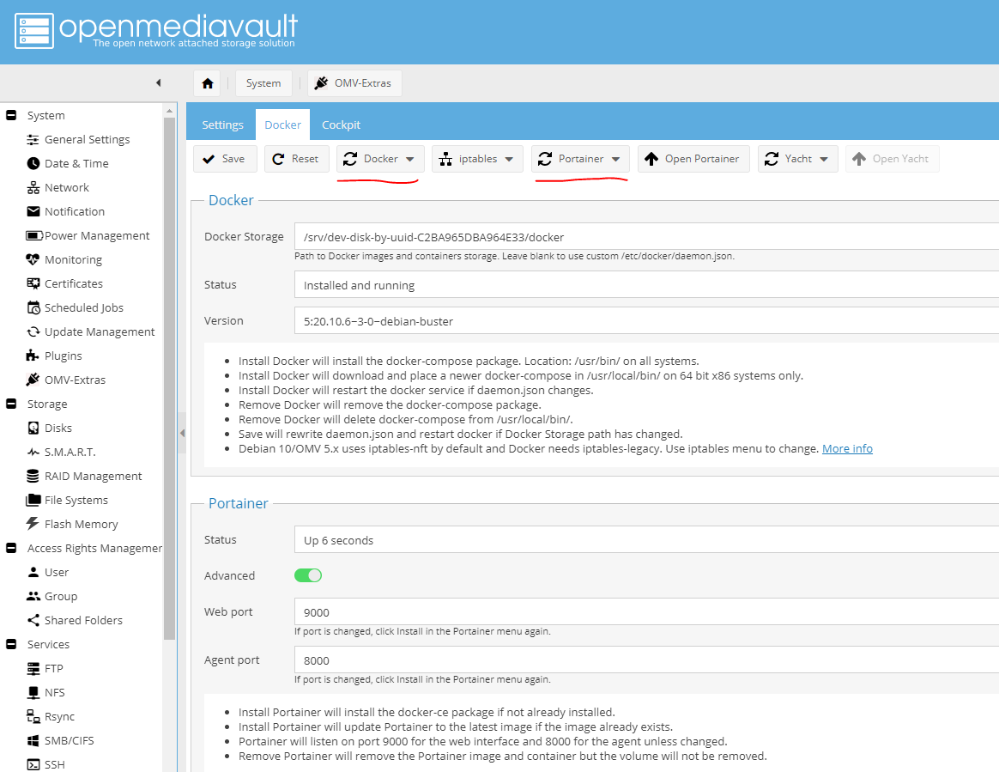
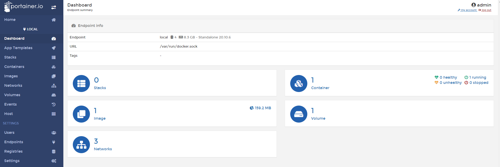

# Setup Docker in Open Media Vault

## Docker using Portainer

* In OMV go to `Access Rights Management` > `Shared Folders`
  * Highlight the `docker` folder that created previously
  * Click the arrow next to `Comment` heading in table and check `Columns` > `Absolute Path`
  * Note the path of the `docker` shared folder
* Go to `System` > `OMV-Extras` and `Docker` tab
  * Paste the path into `Docker Storage` text box
  * `Save`
  * In top nav in tab select `Docker` dropdown and `Install`
    *  It will take a few minutes to run
  * The `Status` field should now show `Installed and running`
  * In top nav in tab select `Portainer` dropdown and `Install`

* Click `Open Portainer` and create an admin user
  * Choose `manage the local docker environment`
  * Click on the `local` docker instance to see various details of whats running

## More details

* [Docker installation on External storage OpenMediaVault 5 with Portainer using Raspberry Pi 4](https://www.youtube.com/watch?v=HinflCTwFcE&list=PLulABMF2ltKoQFbhWSZpvhQx9KXXMibKa&index=24)

[Back to index](index.md)